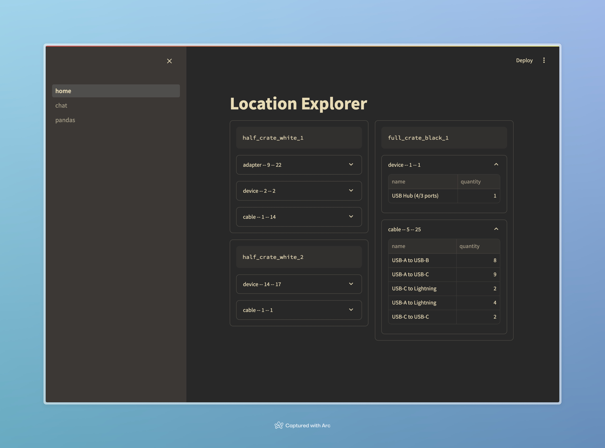

# pyinv

These apps are a little broken right now, the idea is to have a simple Q and A interface to a SQLite database containing an inventory of items. 

The app in the `invbot` directory has other functionality like viewing the data in a pandas dataframe and seeing a summary by storage location.

